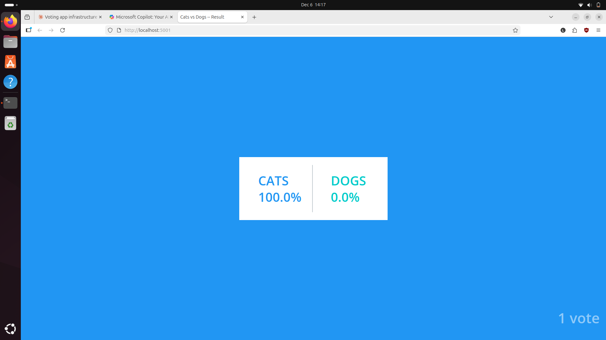
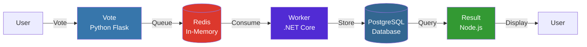
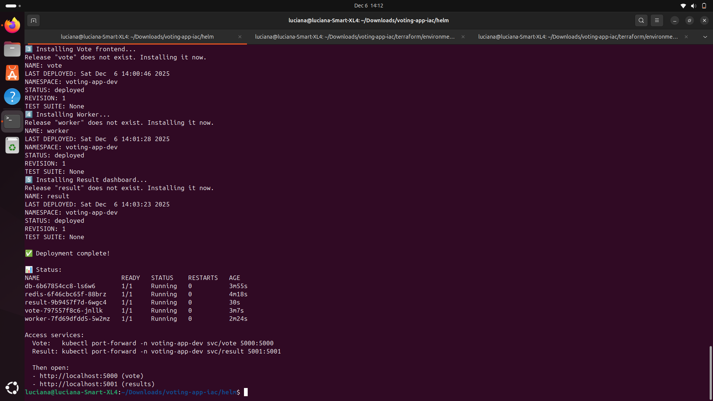
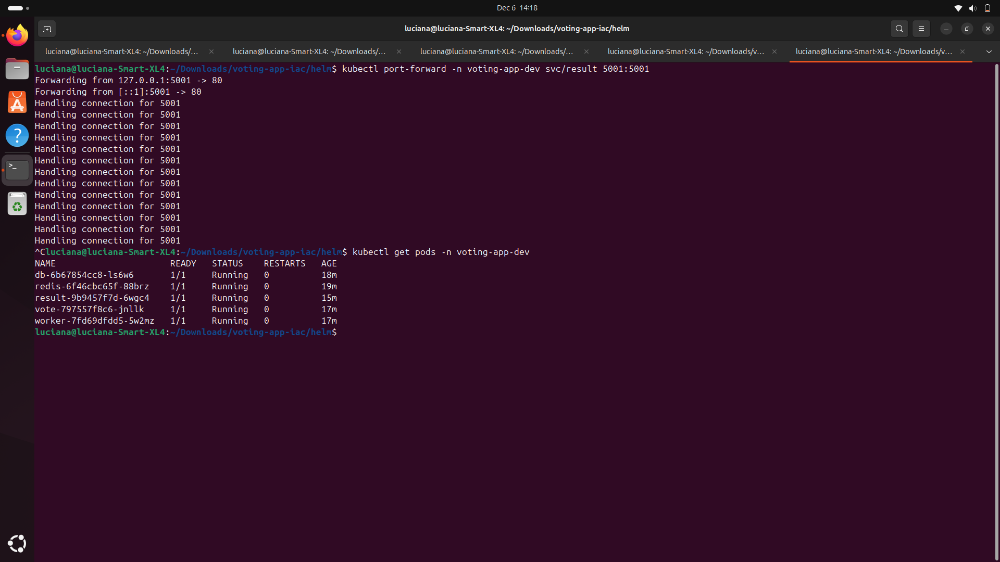
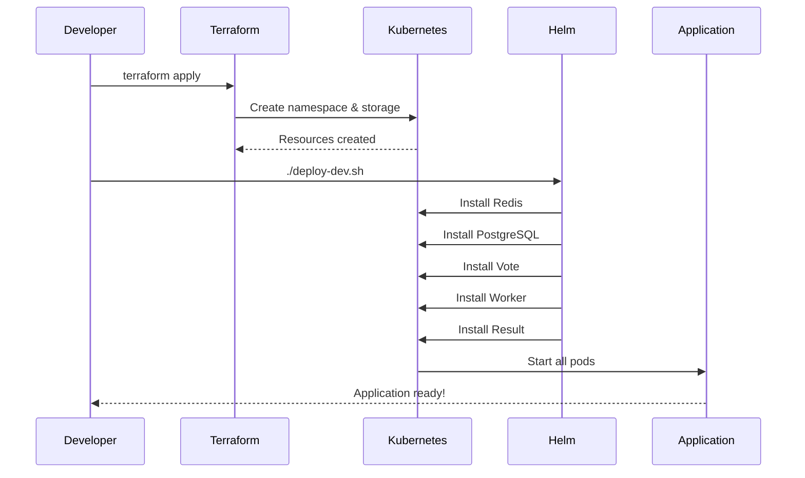

# 𐙚 Voting App - Infrastructure as Code

[](https://kubernetes.io/)
[](https://www.terraform.io/)
[](https://helm.sh/)
[](https://www.docker.com/)

<div align="center">
  
  <p><i>Real-time voting results powered by Kubernetes microservices</i></p>
</div>

**Automated infrastructure deployment for a production-ready microservices application**

 Deploy 5 services with one command | Helm charts + Terraform IaC | Persistent PostgreSQL storage
---

## 📊 Project Overview

This project demonstrates modern DevOps practices by automating the deployment of a multi-service application:

- **Infrastructure as Code** with Terraform
- **GitOps** with Helm charts
- **Container orchestration** with Kubernetes
- **Persistent storage** management
- **Multi-environment** configuration (dev/prod)

### Application Architecture



---

## .ೃ࿔*:･°❀ Features

- ✅ **Automated infrastructure** provisioning with Terraform
- ✅ **Declarative deployments** with Helm charts
- ✅ **Persistent storage** for stateful services (PostgreSQL)
- ✅ **Health checks** and probes for reliability
- ✅ **Immutable deployments** with SHA256 image digests
- ✅ **Secret management** for credentials
- ✅ **Multi-replica support** for high availability
- ✅ **Resource limits** and requests defined
- ✅ **Port-forward** ready for local testing

---

## Quick Start

### Prerequisites

```bash
# Required tools
- Minikube (or any Kubernetes cluster)
- Terraform >= 1.5
- Helm >= 3.0
- kubectl
```

### 1. Provision Infrastructure

```bash
cd terraform/environments/dev
terraform init
terraform apply
```

**Creates:**
- Kubernetes namespace: `voting-app-dev`
- Storage class: `local-storage`

### 2. Deploy Application

```bash
cd ../../../helm
./deploy-dev.sh
```

**Deploys 5 microservices:**
- Redis (in-memory queue)
- PostgreSQL (persistent database)
- Vote (Python frontend)
- Worker (.NET processor)
- Result (Node.js dashboard)

### 3. Access Application

```bash
# Terminal 1: Vote frontend
kubectl port-forward -n voting-app-dev svc/vote 5000:5000

# Terminal 2: Results dashboard
kubectl port-forward -n voting-app-dev svc/result 5001:5001
```

Open in browser:
- **Vote**: http://localhost:5000
- **Results**: http://localhost:5001

---

## 📸 Screenshots

### Deployment Success

*All 5 microservices deployed successfully with 0 restarts*

### Vote Frontend

*Python Flask voting interface - Cats vs Dogs*

### Results Dashboard

*Real-time Node.js dashboard showing vote counts*

### Running Pods

*All pods healthy and running*

---

## Project Structure

```
voting-app-infrastructure/
├── terraform/              # Infrastructure provisioning
│   ├── environments/
│   │   ├── dev/           # Development environment
│   │   └── prod/          # Production environment (future)
│   ├── modules/
│   │   └── kubernetes-cluster/
│   │       └── minikube/  # Local cluster module
│   └── scripts/
│       └── validate-minikube.sh
├── helm/                   # Application deployment
│   ├── redis/             # [Redis Chart](helm/redis/README.md)
│   ├── db/                # [PostgreSQL Chart](helm/db/README.md)
│   ├── vote/              # [Vote Chart](helm/vote/README.md)
│   ├── worker/            # [Worker Chart](helm/worker/README.md)
│   ├── result/            # [Result Chart](helm/result/README.md)
│   ├── deploy-dev.sh      # Deploy all services
│   └── undeploy-dev.sh    # Remove all services
├── docs/
│   ├── architecture.md    # Detailed architecture
│   └── images/            # Screenshots
└── README.md              # This file
```

---

## Technology Stack

| Component | Technology | Purpose |
|-----------|-----------|---------|
| **Vote** | Python + Flask | Frontend web UI |
| **Redis** | Redis 7.0 | In-memory message queue |
| **Worker** | .NET Core | Background vote processor |
| **Database** | PostgreSQL 15 | Persistent vote storage |
| **Result** | Node.js + Socket.io | Real-time results dashboard |
| **Orchestration** | Kubernetes | Container management |
| **IaC** | Terraform | Infrastructure provisioning |
| **Package Manager** | Helm | Application deployment |

---

## Documentation

- **[Terraform Setup](terraform/README.md)** - Infrastructure provisioning guide
- **[Helm Charts](helm/README.md)** - Application deployment overview
- **[Architecture Details](docs/architecture.md)** - In-depth design documentation
- **[Redis Chart](helm/redis/README.md)** - Message queue configuration
- **[PostgreSQL Chart](helm/db/README.md)** - Database setup with persistence
- **[Vote Chart](helm/vote/README.md)** - Frontend service details
- **[Worker Chart](helm/worker/README.md)** - Background processor
- **[Result Chart](helm/result/README.md)** - Dashboard configuration

---

## Use Cases

This project demonstrates:

1. **Microservices Architecture**
   - Service-to-service communication
   - Queue-based async processing
   - Database persistence patterns

2. **Infrastructure as Code**
   - Declarative infrastructure
   - Version-controlled deployments
   - Reproducible environments

3. **DevOps Best Practices**
   - Immutable infrastructure
   - Health monitoring
   - Resource management
   - Secret handling

---

## Testing

### Verify Deployment

```bash
# Check all pods are running
kubectl get pods -n voting-app-dev

# Check services
kubectl get svc -n voting-app-dev

# View logs
kubectl logs -n voting-app-dev -l app=worker -f
```

### Test Vote Flow

1. Vote at http://localhost:5000
2. Check Redis queue:
   ```bash
   kubectl exec -n voting-app-dev deployment/redis -- redis-cli LLEN votes
   ```
3. Verify PostgreSQL:
   ```bash
   kubectl exec -n voting-app-dev deployment/db -- \
     psql -U postgres -c "SELECT * FROM votes;"
   ```
4. See results at http://localhost:5001

---

## Deployment Workflow



---

## Cleanup

### Remove Application

```bash
cd helm
./undeploy-dev.sh
```

### Remove Infrastructure

```bash
cd terraform/environments/dev
terraform destroy
```

**Note:** This keeps PersistentVolumeClaims. To delete:
```bash
kubectl delete pvc --all -n voting-app-dev
```

---

## Future Enhancements

- [ ] **KEDA Autoscaling** - Scale Worker based on Redis queue length
- [ ] **Descheduler** - Optimize pod distribution across nodes
- [ ] **Prometheus + Grafana** - Monitoring and alerting
- [ ] **Ingress with TLS** - HTTPS access with cert-manager
- [ ] **CI/CD Pipeline** - GitHub Actions automation
- [ ] **GKE Deployment** - Cloud production environment
- [ ] **Backup Strategy** - PostgreSQL automated backups

---

## Learning Resources

- [Kubernetes Documentation](https://kubernetes.io/docs/)
- [Terraform Registry](https://registry.terraform.io/)
- [Helm Documentation](https://helm.sh/docs/)
- [Original Voting App](https://github.com/dockersamples/example-voting-app)

---

## Author

**Luciana Cristaldo**

This project demonstrates:
- Infrastructure as Code expertise
- Kubernetes orchestration skills
- DevOps automation practices
- Multi-service architecture design

*Built as part of a portfolio showcasing production-ready infrastructure automation.*

---

## License

Based on the [Docker Voting App Example](https://github.com/dockersamples/example-voting-app) - Educational purposes.

---

## Acknowledgments

- Docker Samples for the original application
- Kubernetes community for excellent documentation
- HashiCorp for Terraform
- CNCF for Helm

---

**⭐⋆.˚✮  If this helped you learn Infrastructure as Code, consider starring the repo!**
