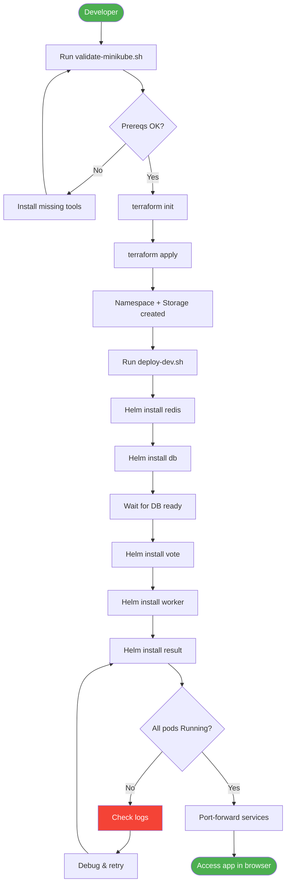

# Architecture Documentation

## System Overview

The voting application is a distributed microservices system demonstrating event-driven architecture, persistent storage, and real-time data processing.

---

## High-Level Architecture


---

## Data Flow


---

## Component Details

### Vote Service (Python Flask)

**Purpose:** User-facing voting interface

**Stack:**
- Python 3.11
- Flask web framework
- Gunicorn WSGI server

**Environment Variables:**
- `REDIS_HOST` - Redis connection
- `REDIS_PORT` - Default 6379
- `OPTION_A` / `OPTION_B` - Vote choices

**Endpoints:**
- `GET /` - Voting UI
- `POST /` - Submit vote

**Health Checks:**
- Liveness: HTTP GET `/`
- Readiness: HTTP GET `/`

---

### Redis Queue

**Purpose:** In-memory message queue for vote buffering

**Stack:**
- Redis 7.0-alpine
- Single instance (dev)

**Data Structure:**
```
votes: LIST
  - Element: JSON {voter_id: "uuid", vote: "a"|"b"}
```

**Why Redis:**
- Fast write performance
- Built-in queue operations (LPUSH/BLPOP)
- Automatic expiration handling

**No Persistence in Dev:**
- Uses `emptyDir` volume
- Data lost on pod restart
- Acceptable for votes (Worker drains queue)

---

### Worker Service (.NET Core)

**Purpose:** Asynchronous vote processor

**Stack:**
- .NET 6.0
- Background Worker Service
- Npgsql (PostgreSQL client)
- StackExchange.Redis

**Process:**
1. Connect to Redis and PostgreSQL on startup
2. Block on Redis queue: `BLPOP votes 0`
3. Receive vote → Validate → Insert into PostgreSQL
4. Repeat indefinitely

**Environment Variables:**
- `REDIS_HOST` / `REDIS_PORT`
- `POSTGRES_HOST` / `POSTGRES_PORT` / `POSTGRES_USER` / `POSTGRES_PASSWORD` / `POSTGRES_DB`

**No HTTP Endpoints:**
- Pure background service
- Monitored via restart count and logs

---

### PostgreSQL Database

**Purpose:** Persistent vote storage

**Stack:**
- PostgreSQL 15-alpine
- Single instance with persistent volume

**Schema:**
```sql
CREATE TABLE votes (
  id VARCHAR(255) NOT NULL UNIQUE,
  vote VARCHAR(255) NOT NULL
);
```

**Persistence:**
- PersistentVolumeClaim: 500Mi (dev)
- StorageClass: `local-storage` (Minikube hostPath)
- Survives pod restarts

**Credentials:**
- Stored in Kubernetes Secret: `db`
- Mounted as env vars from secret

---

### Result Service (Node.js)

**Purpose:** Real-time results dashboard

**Stack:**
- Node.js 18
- Express web server
- Socket.io for websockets
- pg (PostgreSQL client)

**Endpoints:**
- `GET /` - Dashboard UI
- WebSocket connection for live updates

**Query:**
```sql
SELECT vote, COUNT(*) as count 
FROM votes 
GROUP BY vote;
```

**Real-time Updates:**
- Polls PostgreSQL every 500ms
- Pushes updates via Socket.io
- Client auto-refreshes chart

---

## Infrastructure Components

### Kubernetes Resources

**Namespaces:**
- `voting-app-dev` - Development environment
- `voting-app-prod` - Production (future)

**Deployments:**
| Service | Replicas (dev) | CPU Request | Memory Request |
|---------|----------------|-------------|----------------|
| Vote | 1 | 50m | 64Mi |
| Redis | 1 | 50m | 64Mi |
| Worker | 1 | 100m | 128Mi |
| PostgreSQL | 1 | 100m | 128Mi |
| Result | 1 | 50m | 64Mi |

**Services:**
- Vote: ClusterIP (port-forward in dev)
- Result: ClusterIP (port-forward in dev)
- Redis: ClusterIP (internal only)
- PostgreSQL: ClusterIP (internal only)

**Persistent Storage:**
- PostgreSQL PVC: 500Mi
- Access Mode: ReadWriteOnce
- Provisioner: `local-storage`

---

## Deployment Architecture


---

## Network Communication

### Service-to-Service

**Vote → Redis:**
```yaml
# Vote connects via:
REDIS_HOST=redis  # Service DNS name
REDIS_PORT=6379
```

**Worker → Redis:**
```yaml
# Same as Vote
REDIS_HOST=redis
```

**Worker → PostgreSQL:**
```yaml
POSTGRES_HOST=db  # Service DNS name
POSTGRES_PORT=5432
# Credentials from Secret
```

**Result → PostgreSQL:**
```yaml
# Same as Worker
POSTGRES_HOST=db
```

### External Access (Dev)

```bash
# Port forwarding creates local proxy
kubectl port-forward -n voting-app-dev svc/vote 5000:5000
# localhost:5000 → vote:5000 in cluster

kubectl port-forward -n voting-app-dev svc/result 5001:5001
# localhost:5001 → result:5001 in cluster
```

---

## Deployment Workflow



---

## Security Considerations

### Current Implementation (Dev)

**Secrets Management:**
- PostgreSQL credentials in Kubernetes Secret
- Base64 encoded (not encrypted at rest)
- Mounted as environment variables

**Network Policies:**
- None (all pods can communicate)
- Services are ClusterIP (not exposed externally)

**Image Security:**
- Using SHA256 digests for immutability
- Official Docker images from `dockersamples/`

### Production Recommendations

- [ ] Use external secret manager (Vault, AWS Secrets Manager)
- [ ] Implement NetworkPolicies (restrict pod-to-pod traffic)
- [ ] Enable RBAC with service accounts
- [ ] Use private container registry
- [ ] Scan images for vulnerabilities (Trivy, Snyk)
- [ ] Enable TLS for all service communication
- [ ] Implement Pod Security Standards
- [ ] Use Ingress with TLS certificates

---

## Scaling Strategy

### Horizontal Scaling

**Vote Service:**
- Stateless → Safe to scale
- Recommended: 2-3 replicas in prod
- Behind load balancer

**Result Service:**
- Stateless → Safe to scale
- Recommended: 2 replicas in prod
- WebSocket sticky sessions needed

**Worker Service:**
- Stateless consumer → Safe to scale
- **Perfect for KEDA autoscaling**
- Scale based on Redis queue length:
  - 0 votes = 0 workers
  - 100+ votes = 5 workers

**Redis:**
- Single instance in dev
- Prod: Redis Sentinel (HA) or Redis Cluster

**PostgreSQL:**
- Single instance in dev
- Prod: Managed service (Cloud SQL, RDS) or replicas

### Vertical Scaling

Current resource requests are minimal (dev). Production should increase based on load testing.

---

## Monitoring & Observability

### Current State

**Health Checks:**
- Liveness probes on Vote, Result
- Readiness probes on Vote, Result, PostgreSQL

**Logs:**
```bash
kubectl logs -n voting-app-dev -l app=worker -f
```

### Recommended Additions

**Metrics:**
- Prometheus for metrics collection
- Grafana for visualization
- Key metrics:
  - Vote submission rate
  - Redis queue length
  - Worker processing time
  - Database query latency

**Tracing:**
- OpenTelemetry for distributed tracing
- Jaeger for trace visualization

**Alerting:**
- PagerDuty/Opsgenie integration
- Alert on:
  - Worker restart count > 3
  - Redis queue length > 1000
  - Database connection failures

---

## Disaster Recovery

### Current Backups

**PostgreSQL:**
- Data persists in PVC
- No automated backups

**Recovery:**
```bash
# Manual backup
kubectl exec -n voting-app-dev deployment/db -- \
  pg_dump -U postgres postgres > backup.sql

# Restore
kubectl exec -i -n voting-app-dev deployment/db -- \
  psql -U postgres postgres < backup.sql
```

### Production Strategy

- [ ] Automated pg_dump cronjobs
- [ ] Backup to S3/GCS
- [ ] Point-in-time recovery (PITR)
- [ ] Test restore procedures monthly
- [ ] Document RTO/RPO requirements

---

## Future Enhancements

### Phase 1: Advanced Kubernetes Features
- KEDA autoscaling for Worker
- Descheduler for pod optimization
- NetworkPolicies for security
- Ingress with TLS (cert-manager)

### Phase 2: Observability
- Prometheus + Grafana stack
- Loki for log aggregation
- Tempo for distributed tracing
- AlertManager rules

### Phase 3: Cloud Migration
- Deploy to GKE/EKS/AKS
- Use managed PostgreSQL (Cloud SQL/RDS)
- Use managed Redis (Memorystore/ElastiCache)
- CloudSQL Proxy for secure DB access

### Phase 4: CI/CD
- GitHub Actions pipeline
- Automated testing (helm test)
- GitOps with ArgoCD
- Automated rollbacks

---

## References

- [Kubernetes Best Practices](https://kubernetes.io/docs/concepts/configuration/overview/)
- [Helm Chart Development Guide](https://helm.sh/docs/chart_template_guide/)
- [Terraform Kubernetes Provider](https://registry.terraform.io/providers/hashicorp/kubernetes/latest/docs)
- [12-Factor App Methodology](https://12factor.net/) 
